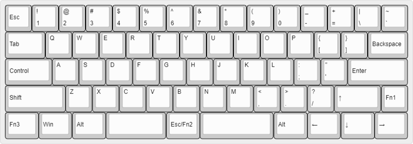
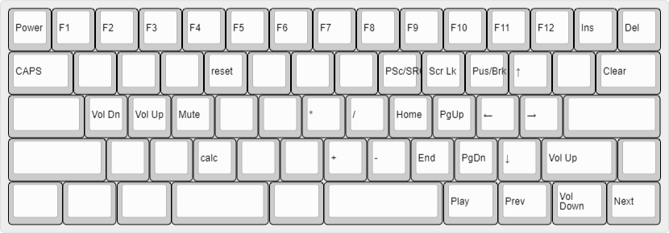
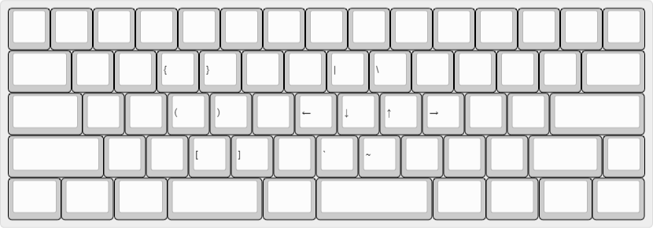
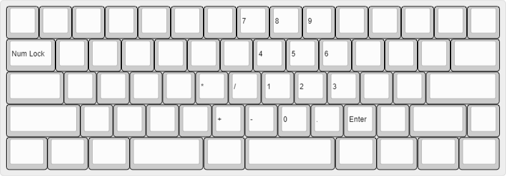

# 01xz65

my keyboard based on qmk

### L0

### L1

### L2

### L3

* Draw layout on [keyboard layout editor](http://www.keyboard-layout-editor.com/)
* Build firmware on [Keyboard Firmware Builder](https://kbfirmware.com/)
* Flash the firmware into keyboard via [qmk toolbox](https://github.com/qmk/qmk_toolbox)

